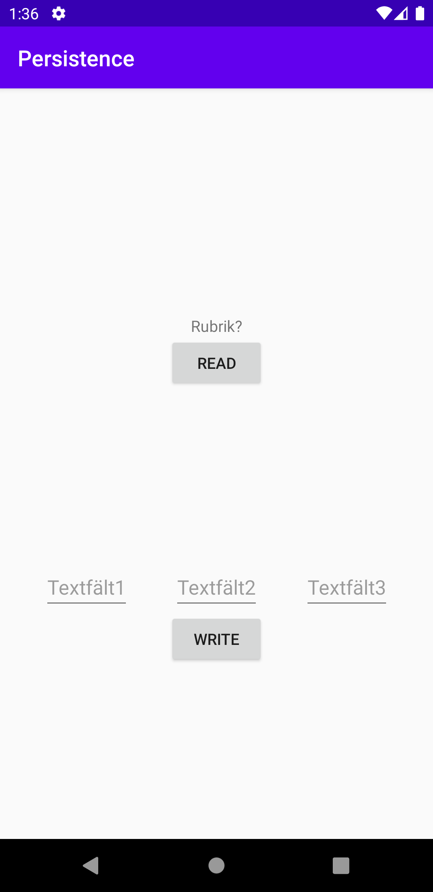
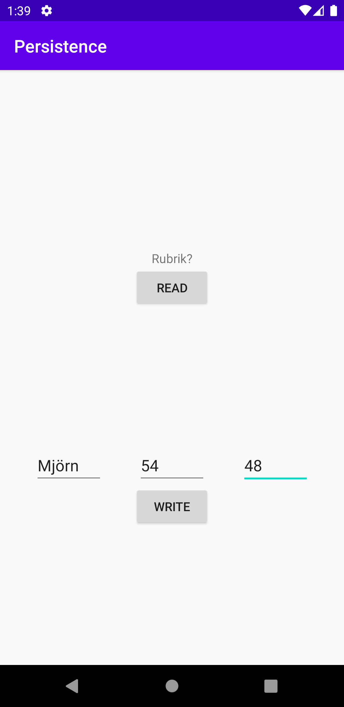
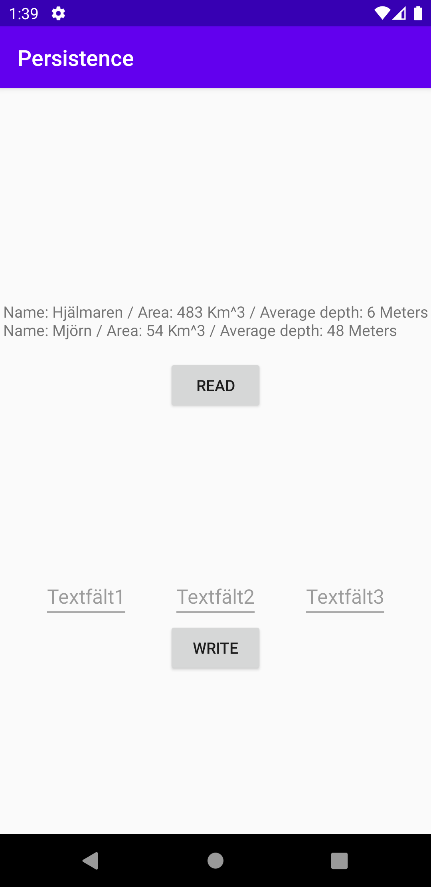

# Rapport
Först skapades de olika widgets det var krav på alla med eget id så de kunde användas i java koden.
```xml
<TextView
        android:id="@+id/text1"
        android:layout_width="wrap_content"
        android:layout_height="wrap_content"
        android:text="@string/rubrik"
        app:layout_constraintBottom_toTopOf="@id/etextarea"
        app:layout_constraintLeft_toLeftOf="parent"
        app:layout_constraintRight_toRightOf="parent"
        app:layout_constraintTop_toTopOf="parent" />

    <androidx.constraintlayout.widget.ConstraintLayout
        android:id="@+id/etextarea"
        android:layout_width="match_parent"
        android:layout_height="wrap_content"
        app:layout_constraintBottom_toBottomOf="parent"
        app:layout_constraintLeft_toLeftOf="parent"
        app:layout_constraintRight_toRightOf="parent"
        app:layout_constraintTop_toBottomOf="@+id/text1">
        <EditText
            android:id="@+id/etext1"
            android:layout_width="wrap_content"
            android:layout_height="wrap_content"
            android:hint="@string/textf_lt1"
            android:inputType="text"
            app:layout_constraintBottom_toBottomOf="parent"
            app:layout_constraintLeft_toLeftOf="parent"
            app:layout_constraintRight_toLeftOf="@id/etext2"
            app:layout_constraintTop_toTopOf="parent" />
        <EditText
            android:id="@+id/etext2"
            android:layout_width="wrap_content"
            android:layout_height="wrap_content"
            android:hint="@string/textf_lt2"
            android:inputType="number"
            app:layout_constraintBottom_toBottomOf="parent"
            app:layout_constraintLeft_toRightOf="@id/etext1"
            app:layout_constraintRight_toLeftOf="@id/etext3"
            app:layout_constraintTop_toTopOf="parent" />
        <EditText
            android:id="@+id/etext3"
            android:layout_width="wrap_content"
            android:layout_height="wrap_content"
            android:hint="@string/textf_lt3"
            android:inputType="number"
            app:layout_constraintBottom_toBottomOf="parent"
            app:layout_constraintLeft_toRightOf="@id/etext2"
            app:layout_constraintRight_toRightOf="parent"
            app:layout_constraintTop_toTopOf="parent" />
    </androidx.constraintlayout.widget.ConstraintLayout>

        <Button
            android:id="@+id/read"
            android:layout_width="wrap_content"
            android:layout_height="wrap_content"
            android:text="@string/read"
            app:layout_constraintLeft_toLeftOf="parent"
            app:layout_constraintRight_toRightOf="parent"
            app:layout_constraintTop_toBottomOf="@+id/text1" />

        <Button
            android:id="@+id/write"
            android:layout_width="wrap_content"
            android:layout_height="wrap_content"
            android:text="@string/write"
            app:layout_constraintLeft_toLeftOf="parent"
            app:layout_constraintRight_toRightOf="parent"
            app:layout_constraintTop_toBottomOf="@+id/etextarea" />
```
Efter det skapades en java klass för tabellern med ett antal fasta värden, en funktion som skapar själva tabellen och en funktion som raderar tabellen.
``` java
public class Tables {
    static class Lake {

        static final String TABLE_NAME = "lake";
        static final String COLUMN_NAME_ID = "id";
        static final String COLUMN_NAME_NAME = "name";
        static final String COLUMN_NAME_SIZE = "size";
        static final String COLUMN_NAME_DEPTH = "depth";

    }

    static final String SQL_CREATE_TABLE_LAKE =
            // "CREATE TABLE lake (id INTEGER PRIMARY KEY, name TEXT, size INT)"
            "CREATE TABLE " + Lake.TABLE_NAME + " (" +
                    Lake.COLUMN_NAME_ID + " INTEGER PRIMARY KEY," +
                    Lake.COLUMN_NAME_NAME + " TEXT," +
                    Lake.COLUMN_NAME_SIZE + " INT," +
                    Lake.COLUMN_NAME_DEPTH + " INT)";

    static final String SQL_DELETE_TABLE_LAKE =
            // "DROP TABLE IF EXISTS lake"
            "DROP TABLE IF EXISTS " + Lake.TABLE_NAME;
}
```
och till den skapades en hjälp klass som ger databasen ett namn och versions nummer, skapar en databas om den inte redan finns med hjälp av funktionen från _Tables_ klassen och updaterar databasen om den finns genom att radera databasen och sedan kalla på funktionen för att skapa databasen. detta görs med hjälp av SQLite biblotek.
```java
import android.content.Context;
import android.database.sqlite.SQLiteDatabase;
import android.database.sqlite.SQLiteOpenHelper;

public class Helper extends SQLiteOpenHelper {
    private static final int DATABASE_VERSION = 1; // If this is incremented onUpgrade() will be executed
    private static final String DATABASE_NAME = "Lake.db"; // The file name of our database

    Helper(Context context) {
        super(context, DATABASE_NAME, null, DATABASE_VERSION);
    }

    // This method is executed only if there is not already a database in the file `Lake.db`
    @Override
    public void onCreate(SQLiteDatabase sqLiteDatabase) {
        sqLiteDatabase.execSQL(Tables.SQL_CREATE_TABLE_LAKE);
    }

    // This method is executed only if the database version has changed, e.g. from 1 to 2
    @Override
    public void onUpgrade(SQLiteDatabase sqLiteDatabase, int oldVersion, int newVersion) {
        sqLiteDatabase.execSQL(Tables.SQL_DELETE_TABLE_LAKE);
        onCreate(sqLiteDatabase);
    }
}
```
Både databasen och hjälpredan deklareras som privatamedlemsvariabler i huvudaktiviteten.
```java
private SQLiteDatabase database;
private Helper helper;
```
och i `onCreate` skapas en ny hjälpreda för sessionen och databasen kopplas till den.
```java
helper = new Helper(this);
database = helper.getWritableDatabase();
```
det skapas även en klass för det som finns i databasen vid namn _Lake_ med ett antal värden, en konstruktor samt get och set funktioner för varje värde så man kan ändra och nyttja de olika delarna av klassen.
```java
public class Lake {
    private long id;
    private String name;
    private int size;
    private int depth;
    //default
    public Lake()
    {
        id=-1;
        name = "Missing name";
        size = -1;
        depth = -1;
    }

    public Lake(long i, String n, int s, int d) {
        id = i;
        name = n;
        size = s;
        depth = d;
    }

    public void setId(long id) {
        this.id = id;
    }

    public long getId() {
        return id;
    }

    public void setName(String name) {
        this.name = name;
    }

    public String getName() {
        return name;
    }

    public void setSize(int size) {
        this.size = size;
    }

    public int getDepth() {
        return depth;
    }

    public void setDepth(int depth) {
        this.depth = depth;
    }

    public int getSize() {
        return size;
    }
    public String info(){
        String txt = "Name: "+name+" / Area: "+size+" Km^3 / Average depth: "+depth+" Meters";
        return txt;
    }

    @Override
    public String toString(){
        return name;
    }
}
```
I huvudaktiviteten skapades en variabel för knappen write som gavs en `OnClickListener` som hämtar texten från de tre olika `EditText` elementen och lägger dem i egna variabler, konverterar den första edittexten till string och de två andra till int samt använder sig av funktionen `addLake` för att lägga till dem till databasen.
```java
Button write = findViewById(R.id.write);
write.setOnClickListener(new View.OnClickListener() {
    @Override
    public void onClick(View v) {
        EditText editText1 =findViewById(R.id.etext1);
        EditText editText2 =findViewById(R.id.etext2);
        EditText editText3 =findViewById(R.id.etext3);
        String n= editText1.getText().toString();
        int s=Integer.parseInt(editText2.getText().toString());// konverterar string värdet till int
        int d=Integer.parseInt(editText3.getText().toString());
        addLake(n,s,d);
    }
});
```
`addLake` funktionen tar emot en string och två int och använder sig av `ContentValues` för att ta värderna på de tre olika variablerna som den sedan lägger in i databasen.
```java
private long addLake(String name, int size, int depth) {
    ContentValues values = new ContentValues();
    values.put(Tables.Lake.COLUMN_NAME_NAME, name);
    values.put(Tables.Lake.COLUMN_NAME_SIZE, size);
    values.put(Tables.Lake.COLUMN_NAME_DEPTH, depth);
    return database.insert(Tables.Lake.TABLE_NAME, null, values);
}
```
Det skapas en privat medlems variabel av typen `TextView` vid namn _textView_
```java
private TextView textView;
```
_texView_ kopplas till `TextView` elementet i xml filen och en variabel av typen `Button` vid namn _read_ skapas kopplat till read knappen. _read_ ges en `OnClickListener` som skapar en lista med resultatet från funktionen `fetchLakes`, skapar en sträng som är tom vid namn _tmp_, använder sig av en for loop som loopar så länge i är midre än antalet värden i listan vari strängen från funktionen `info`, från _Lake_ klassen, för den listposition loopen är på samt en radbrytning läggs till i _tmp_ strängen. sist så sätter den _textView_ till texten från _tmp_. 
```java
textView = findViewById(R.id.text1);
Button read=findViewById(R.id.read);
read.setOnClickListener(new View.OnClickListener() {
    @Override
    public void onClick(View v) {
        List<Lake> temp = fetchLakes();
        String tmp = "";
        for (int i = 0; i <temp.size() ; i++) {
            tmp += temp.get(i).info()+"\n";
        }
        textView.setText(tmp);
    }
});
```
`fetchLakes` funktionen skapar en lista med hjälp av ett `Cursor` objekt som hämtar tabell namnen från databasen, det skapas en ny lista av typen arraylist som kallas för _lakes_, med hjälp av en ``while`` funktion som loopar så länge ``Cursor`` objektet kan peka på nästa så skapas ett nytt ``Lake`` objekt som hämtar värderna på de olika variablerna som finns i tabellen på den position den är på och sedan lägger till det till listan. När loppen tar slut stängs ``Cursor`` objektet och listan skickas till det som aktiverade funktionen.
```java
private List<Lake> fetchLakes() {
    Cursor cursor = database.query(Tables.Lake.TABLE_NAME, null, null, null, null, null, null);
    List<Lake> lakes = new ArrayList<>();
    while (cursor.moveToNext()) {
        Lake lake = new Lake(
                cursor.getLong(cursor.getColumnIndexOrThrow(Tables.Lake.COLUMN_NAME_ID)),
                cursor.getString(cursor.getColumnIndexOrThrow(Tables.Lake.COLUMN_NAME_NAME)),
                cursor.getInt(cursor.getColumnIndexOrThrow(Tables.Lake.COLUMN_NAME_SIZE)),
                cursor.getInt(cursor.getColumnIndexOrThrow(Tables.Lake.COLUMN_NAME_DEPTH))
        );
        lakes.add(lake);
    }
    cursor.close();
    return lakes;
}
```

Start skärm

efter Write knappen klickats

efter Read knappen klickats
